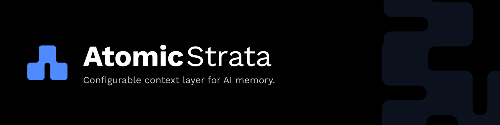

  

<h1 align="center">Atomic Strata</h1>

  
  
  
  
  
  
  

  <a href="https://docs.atomicstrata.ai/"><b>Docs</b></a> ·
  <a href="https://atomicstrata.ai/blog/the-ai-memory-industry-has-a-black-box-problem"><b>Read the manifesto</b></a>

 

## Why Atomic Strata

AI is becoming stateful. Its memory should be infrastructure, not a hosted black box.

* **Configurable.** Compose models, embeddings, storage, and policy around your stack.
* **Durable.** Persist across sessions, agents, and teams.
* **Inspectable.** Read every retrieval. Version every claim.
* **Governed.** Scopes, audit trails, and correction workflows. First-class, not bolted on.

## Quickstart

Get up and running, each a single page in the docs:

* [**Core Quickstart**](https://docs.atomicstrata.ai/quickstart). Run AtomicMemory Core locally from the published Docker image, then ingest and search over HTTP.
* [**SDK Quickstart**](https://docs.atomicstrata.ai/sdk/quickstart). Install `@atomicmemory/sdk`, point `MemoryClient` at Core, ingest and search typed.
* [**CLI**](https://docs.atomicstrata.ai/cli). Drive Core from the terminal — ingest, search, and inspect memory without writing code.
* [**Integrations**](https://docs.atomicstrata.ai/integrations/overview). Wire AtomicMemory into agents, frameworks, and editors.

## Projects

| Repo | What it is |
| --- | --- |
| [**atomicmemory**](https://github.com/atomicstrata/atomicmemory) | Monorepo for the Core HTTP memory engine (Postgres + pgvector, Docker) and the typed TypeScript SDK with a provider abstraction. See the [package matrix](https://github.com/atomicstrata/atomicmemory#package-matrix). |
| [**atomicmemory-python**](https://github.com/atomicstrata/atomicmemory-python) | Python SDK for Python-native AI systems. |
| [**llm-wiki-compiler**](https://github.com/atomicstrata/llm-wiki-compiler) | The knowledge compiler. Raw sources in, interlinked wiki out. |

## Contribute

We are in Developer Preview, so the surface is moving. The most useful contributions right now are issues and discussions, not pull requests.

* **Found a bug or rough edge?** [Open an issue](https://github.com/atomicstrata/atomicmemory-core/issues) on the relevant repo.
* **Have a question, an idea, or want to share what you are building?** [Start a discussion](https://github.com/atomicstrata/atomicmemory-core/discussions).
* **Want to chat with the team and other early users?** [Join us on Discord](https://discord.gg/eZRfYJFdp).
* **Follow shipping updates and design notes** on [@atomicstrata](https://x.com/atomicstrata).

For commercial use, design partnerships, or anything sensitive, [email support](mailto:support@atomicstrata.ai).

## Stay close

[Website](https://atomicstrata.ai) · [Docs](https://docs.atomicstrata.ai/) · [Blog](https://atomicstrata.ai/blog) · [Discord](https://discord.gg/eZRfYJFdp) · [X](https://x.com/atomicstrata)

Apache 2.0. Built in the United States.
